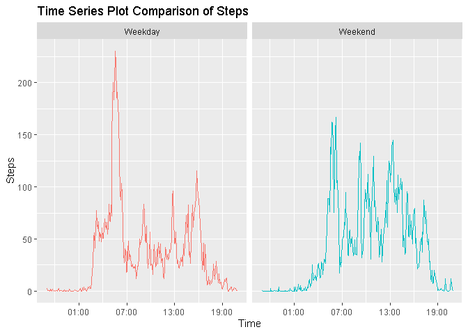

```r
library(knitr)
```

```
## Warning: package 'knitr' was built under R version 3.5.3
```

```r
library(dplyr)
```

```
## Warning: package 'dplyr' was built under R version 3.5.3
```

```
## 
## Attaching package: 'dplyr'
```

```
## The following objects are masked from 'package:stats':
## 
##     filter, lag
```

```
## The following objects are masked from 'package:base':
## 
##     intersect, setdiff, setequal, union
```

```r
library(ggplot2)
```

```
## Warning: package 'ggplot2' was built under R version 3.5.3
```

```r
library(data.table)
```

```
## Warning: package 'data.table' was built under R version 3.5.3
```

```
## 
## Attaching package: 'data.table'
```

```
## The following objects are masked from 'package:dplyr':
## 
##     between, first, last
```

```r
library(scales)
```

```
## Warning: package 'scales' was built under R version 3.5.3
```

```r
library(lubridate)
```

```
## Warning: package 'lubridate' was built under R version 3.5.3
```

```
## 
## Attaching package: 'lubridate'
```

```
## The following objects are masked from 'package:data.table':
## 
##     hour, isoweek, mday, minute, month, quarter, second, wday, week,
##     yday, year
```

```
## The following objects are masked from 'package:dplyr':
## 
##     intersect, setdiff, union
```

```
## The following objects are masked from 'package:base':
## 
##     date, intersect, setdiff, union
```


## Loading and preprocessing the data

```r
zipUrl <- "https://d396qusza40orc.cloudfront.net/repdata%2Fdata%2Factivity.zip"
zipFile <- "activity2.zip"

if (!file.exists(zipFile)) {
  download.file(zipUrl, zipFile, mode = "wb")
}

# unzip zip file 
unzip(zipFile)
```


```r
activity <- read.csv("activity.csv")
## activity <- subset(activity,!is.na(steps))
```

### Plot the number of steps by interval to verify the data was loaded correctly.

```r
ggplot(activity,aes(x=interval, y=steps)) + 
  geom_point()
```

```
## Warning: Removed 2304 rows containing missing values (geom_point).
```

<!-- -->


## Histogram of the total number of steps taken each day


```r
activity$date <- as.Date(activity$date)
total_steps <- aggregate(steps ~ date, data = activity, sum)
plot <- ggplot(total_steps, aes(x=steps)) +
  geom_histogram(fill = "deepskyblue4", bins = 15) +
  labs(title = "Daily Steps", x = "Step Count", y = "Frequency")
print(plot)
```

<!-- -->
### Mean and median number of steps taken each day

```r
mean(total_steps$steps, na.rm = T)
```

```
## [1] 10766.19
```

```r
median(total_steps$steps,na.rm=T)
```

```
## [1] 10765
```


## Time series plot of the average number of steps taken

```r
interval_steps <- aggregate(steps ~ interval, data = activity, mean)
interval_steps$time <- as.character(interval_steps$interval)
for (i in 1:2){
  interval_steps$time[i] <- as.character(paste0("0",interval_steps$time[i]))
}
for (i in 1:12){
  interval_steps$time[i] <- as.character(paste0("00",interval_steps$time[i]))
}
for (i in 13:120){
  interval_steps$time[i] <- as.character(paste0("0",interval_steps$time[i]))
}
interval_steps$time <- as.POSIXct(interval_steps$time, format = "%H%M")
```


```r
plot2 <- ggplot(interval_steps, aes(x = time, y = steps)) +
  geom_line(col = "deepskyblue4") +
  labs(title = "Time Series Plot of Average Steps Taken", x = "Time of Day", y = "Steps") +
  scale_x_datetime(labels = date_format("%H:%M", tz = "MST"), date_breaks = "4 hours")
print(plot2)
```

<!-- -->

## The 5-minute interval that on average contains the maximum number of steps

```r
interval_steps[which.max(interval_steps$steps),1:2]
```

```
##     interval    steps
## 104      835 206.1698
```
## Inputing missing data
The total amount of NA's and the percentage of missing step data.

```r
nas <- is.na(activity$steps)
sum(nas)
```

```
## [1] 2304
```

```r
mean(nas)
```

```
## [1] 0.1311475
```
Function to impute the mean for a 5-minute interval into the appropriate mssing data (NA's).

```r
replaceNas= function(steps, interval) {
  replace = NA
  if (!is.na(steps)) { 
    replace = steps } 
  else { 
    replace = interval_steps[interval_steps$interval == interval, "steps"]}
  return(replace) }
```
Apply 'replaceNas' function.

```r
filled_activity_data = activity
filled_activity_data$steps = mapply(replaceNas, filled_activity_data$steps, filled_activity_data$interval)
```

## Histogram of the total number of steps taken each day after missing values were imputed

```r
total_steps_filled <- aggregate(steps ~ date, data = filled_activity_data, sum)
plot3 <- ggplot(total_steps_filled, aes(x = steps)) + 
  geom_histogram(fill = "deepskyblue4", bins = 11) + 
  labs(title = "Daily Steps with replaces NA's", x = "Step Count", y = "Frequency")
print(plot3)
```

<!-- -->

## Panel plot comparing the average number of steps taken per 5-minute intervals for Weekdays and Weekends
Creating two new factor variables showing the day of the week, and if its a weekday of weekend. 

```r
filled_activity_data$day <- weekdays(filled_activity_data$date)
weekday <- c("Monday","Tuesday","Wednesday","Thursday","Friday")
weekDayOp <- function(dayofweek) {
  fill = ""
  if (dayofweek %in% weekday) {
    fill = "Weekday" }
  else {
    fill = "Weekend" }
  return(fill) }
filled_activity_data$weekday <- mapply(weekDayOp,filled_activity_data$day)
```

Calculating the average number of steps per 5-minute interval for weekdays and weekends.

```r
filled_totals_day <- aggregate(steps ~ interval + weekday, data = filled_activity_data, mean)
```

Coverting 'interval' column data to a vailid date-time format.

```r
filled_totals_day$time <- as.character(filled_totals_day$interval)
for (i in 1:2){
  filled_totals_day$time[i] <- as.character(paste0("0",filled_totals_day$time[i]))
}
for (i in 1:12){
  filled_totals_day$time[i] <- as.character(paste0("00",filled_totals_day$time[i]))
}
for (i in 13:120){
  filled_totals_day$time[i] <- as.character(paste0("0",filled_totals_day$time[i]))
}
for (i in 289:290){
  filled_totals_day$time[i] <- as.character(paste0("0",filled_totals_day$time[i]))
}
for (i in 289:300){
  filled_totals_day$time[i] <- as.character(paste0("0",filled_totals_day$time[i]))
}
for (i in 301:408){
  filled_totals_day$time[i] <- as.character(paste0("0",filled_totals_day$time[i]))
}
filled_totals_day$time <- as.POSIXct(filled_totals_day$time, format = "%H%M")
```

Now that we have the valid date time format we can have a cleaner looking Time-Seriesplot, for comparison of the average 24-hour period on weekdays and weekends.

```r
plot4 <- ggplot(filled_totals_day, aes(time, steps, col = factor(weekday))) +
  facet_grid(.~factor(weekday)) +
  geom_line(show.legend = F) +
  labs(x = "Time") +
  labs(y = "Steps") +
  labs(title = "Time Series Plot Comparison of Steps") +
  scale_x_datetime(labels = date_format("%H:%M", tz = "MST"), date_breaks = "6 hours")
print(plot4)
```

<!-- -->
